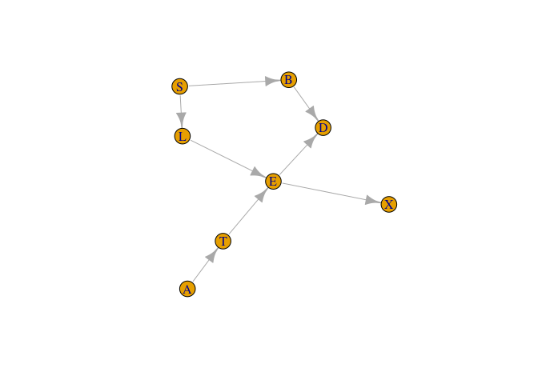
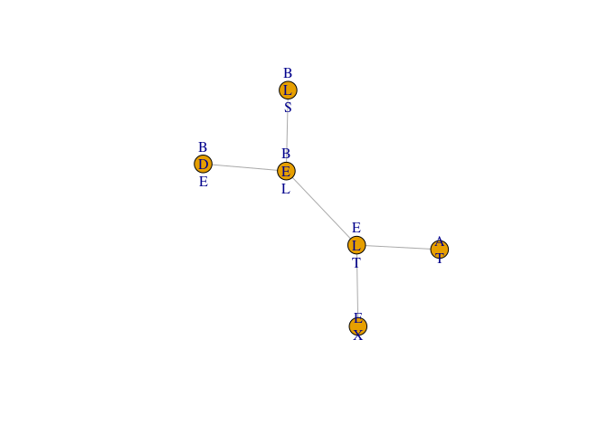
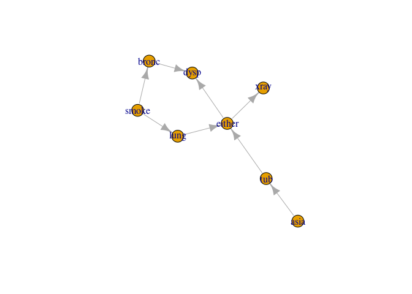
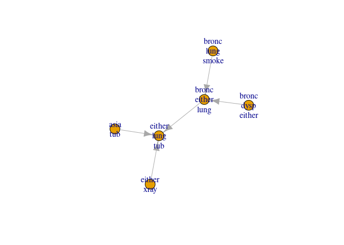
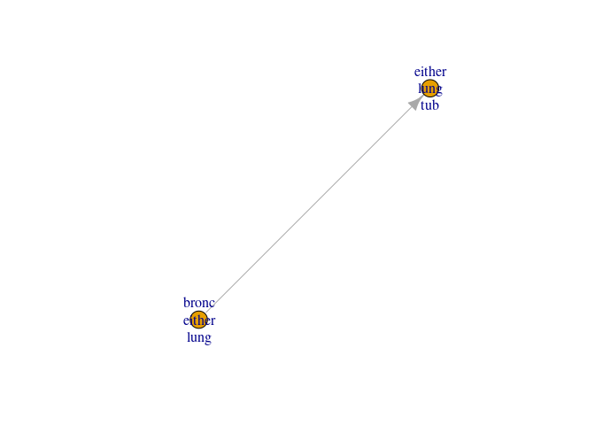
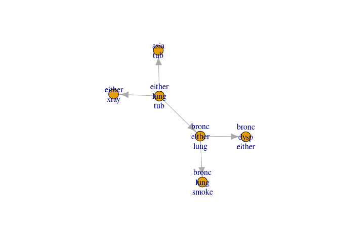

# jti: Junction Tree Inference 

<!-- badges: start -->

[](https://github.com/mlindsk/jti/actions)
[](https://cran.r-project.org/package=jti)
<!-- badges: end -->

## About

The **jti** package (pronounced ‘yeti’) is a memory efficient
implementaion of the junction tree algorithm (JTA) using the
Lauritzen-Spiegelhalter scheme. Why is it memory efficient? Because we
use a  for
the potentials which enable us to handle large and complex graphs where
the variables can have an arbitrary large number of levels. The **jti**
package is a big part of the software paper .

## Installation

Current stable release from CRAN:

``` r
install.packages("jti")
```

Development version (see `README.md` for new features):

``` r
devtools::install_github("mlindsk/jti", build_vignettes = FALSE)
```

## Libraries

``` r
library(jti)
library(igraph)
```

## Setting up the network

``` r
el <- matrix(c(
  "A", "T",
  "T", "E",
  "S", "L",
  "S", "B",
  "L", "E",
  "E", "X",
  "E", "D",
  "B", "D"),
  nc = 2,
  byrow = TRUE
)

g <- igraph::graph_from_edgelist(el)
plot(g)
```



We use the asia data; see the man page `(?asia)`

### Compilation

Checking and conversion

``` r
cl <- cpt_list(asia, g)
cl
#>  List of CPTs 
#>  -------------------------
#>   P( A )
#>   P( T | A )
#>   P( E | T, L )
#>   P( S )
#>   P( L | S )
#>   P( B | S )
#>   P( X | E )
#>   P( D | E, B )
#> 
#>   <bn_, cpt_list, list> 
#>  -------------------------
```

Compilation

``` r
cp <- compile(cl)
cp
#>  Compiled network  (cpts initialized) 
#>  ------------------------------------ 
#>   Nodes: 8 
#>   Cliques: 6 
#>    - max: 3 
#>    - min: 2 
#>    - avg: 2.67
#>   <bn_, charge, list> 
#>  ------------------------------------
# plot(get_graph(cp)) # Should give the same as plot(g)
```

After the network has been compiled, the graph has been triangulated and
moralized. Furthermore, all conditional probability tables (CPTs) has
been designated to one of the cliques (in the triangulated and moralized
graph).

### Example 1: sum-flow without evidence

``` r
jt1 <- jt(cp)
jt1
#>  Junction Tree 
#>  ------------------------- 
#>   Propagated: full 
#>   Flow: sum 
#>   Cliques: 6 
#>    - max: 3 
#>    - min: 2 
#>    - avg: 2.67
#>   <jt, list> 
#>  -------------------------
plot(jt1)
```


Query probabilities

``` r
query_belief(jt1, c("E", "L", "T"))
#> $E
#> E
#>         n         y 
#> 0.9257808 0.0742192 
#> 
#> $L
#> L
#>     n     y 
#> 0.934 0.066 
#> 
#> $T
#> T
#>      n      y 
#> 0.9912 0.0088
query_belief(jt1, c("B", "D", "E"), type = "joint")
#> , , B = y
#> 
#>    E
#> D            n           y
#>   y 0.36261346 0.041523361
#>   n 0.09856873 0.007094444
#> 
#> , , B = n
#> 
#>    E
#> D            n           y
#>   y 0.04637955 0.018500278
#>   n 0.41821906 0.007101117
```

It should be noticed, that the above could also have been achieved by

``` r
jt1 <- jt(cp, propagate = "no")
jt1 <- propagate(jt1, prop = "full")
```

That is; it is possible to postpone the actual propagation.

### Example 2: sum-flow with evidence

``` r
e2  <- c(A = "y", X = "n")
jt2 <- jt(cp, e2) 
query_belief(jt2, c("B", "D", "E"), type = "joint")
#> , , B = y
#> 
#>    E
#> D           n            y
#>   y 0.3914092 3.615182e-04
#>   n 0.1063963 6.176693e-05
#> 
#> , , B = n
#> 
#>    E
#> D            n            y
#>   y 0.05006263 2.009085e-04
#>   n 0.45143057 7.711638e-05
```

Notice that, the configuration `(D,E,B) = (y,y,n)` has changed
dramatically as a consequence of the evidence. We can get the
probability of the evidence:

``` r
query_evidence(jt2)
#> [1] 0.007152638
```

### Example 3: max-flow without evidence

``` r
jt3 <- jt(cp, flow = "max")
mpe(jt3)
#>   A   T   E   L   S   B   X   D 
#> "n" "n" "n" "n" "n" "n" "n" "n"
```

### Example 4: max-flow with evidence

``` r
e4  <- c(T = "y", X = "y", D = "y")
jt4 <- jt(cp, e4, flow = "max")
mpe(jt4)
#>   A   T   E   L   S   B   X   D 
#> "n" "y" "y" "n" "y" "y" "y" "y"
```

Notice, that `T`, `E`, `S`, `B`, `X` and `D` has changed from `"n"` to
`"y"` as a consequence of the new evidence `e4`.

### Example 5: specifying a root node and only collect to save run time

``` r
cp5 <- compile(cpt_list(asia, g) , root_node = "X")
jt5 <- jt(cp5, propagate = "collect")
```

We can only query from the variables in the root clique now but we have
ensured that the node of interest, “X”, does indeed live in this clique.
The variables are found using `get_clique_root`.

``` r
query_belief(jt5, get_clique_root(jt5), "joint")
#>    E
#> X            n            y
#>   n 0.88559032 0.0004011849
#>   y 0.04019048 0.0738180151
```

## Example 6: Compiling from a list of conditional probabilities

  - We need a list with CPTs which we extract from the asia2 object
      - the list must be named with child nodes
      - The elements need to be array-like objects

<!-- end list -->

``` r
cl  <- cpt_list(asia2)
cp6 <- compile(cl)
```

Inspection; see if the graph correspond to the cpts

``` r
plot(get_graph(cp6)) 
```



This time we specify that no propagation should be performed

``` r
jt6 <- jt(cp6, propagate = "no")
```

We can now inspect the collecting junction tree and see which cliques
are leaves and parents

``` r
plot(jt6)
```



``` r
get_cliques(jt6)
#> $C1
#> [1] "asia" "tub" 
#> 
#> $C2
#> [1] "either" "lung"   "tub"   
#> 
#> $C3
#> [1] "bronc"  "either" "lung"  
#> 
#> $C4
#> [1] "bronc" "lung"  "smoke"
#> 
#> $C5
#> [1] "bronc"  "dysp"   "either"
#> 
#> $C6
#> [1] "either" "xray"
get_clique_root(jt6)
#> [1] "either" "lung"   "tub"
jt_leaves(jt6)
#> [1] 1 4 5 6
unlist(jt_parents(jt6))
#> [1] 2 3 3 2
```

That is; - clique 2 is parent of clique 1 - clique 3 is parent of clique
4 etc.

Next, we send the messages from the leaves to the parents

``` r
jt6 <- send_messages(jt6)
```

Inspect again

``` r
plot(jt6)
```



Send the last message to the root and inspect

``` r
jt6 <- send_messages(jt6)
plot(jt6)
```



The arrows are now reversed and the outwards (distribute) phase begins

``` r
jt_leaves(jt6)
#> [1] 2
jt_parents(jt6)
#> [[1]]
#> [1] 1 3 6
```

Clique 2 (the root) is now a leave and it has 1, 3 and 6 as parents.
Finishing the message passing

``` r
jt6 <- send_messages(jt6)
jt6 <- send_messages(jt6)
```

Queries can now be performed as normal

``` r
query_belief(jt6, c("either", "tub"), "joint")
#>       tub
#> either    yes       no
#>    yes 0.0104 0.054428
#>    no  0.0000 0.935172
```

## Example 7: Fitting a decomposable model and apply JTA

We use the `ess` package (on CRAN), found at
<https://github.com/mlindsk/ess>, to fit an undirected decomposable
graph to data.

``` r
library(ess)

g7  <- ess::fit_graph(asia, trace = FALSE)
ig7 <- ess::as_igraph(g7)
cp7 <- compile(pot_list(asia, ig7))
jt7 <- jt(cp7)

query_belief(jt7, get_cliques(jt7)[[4]], type = "joint")
#> , , T = n
#> 
#>    L
#> E       n      y
#>   n 0.926 0.0000
#>   y 0.000 0.0652
#> 
#> , , T = y
#> 
#>    L
#> E       n     y
#>   n 0.000 0e+00
#>   y 0.008 8e-04
```
