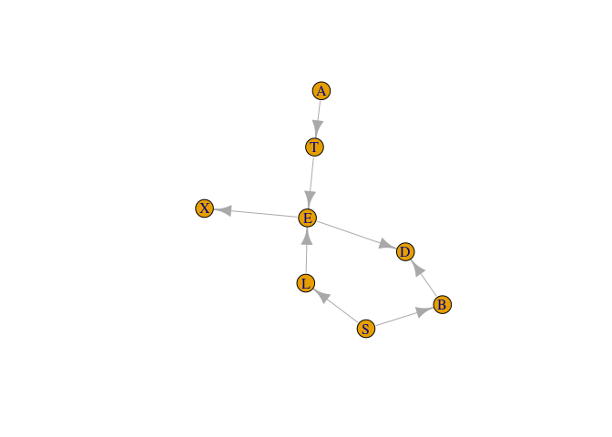
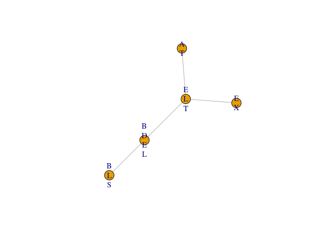

jti: Junction Tree Inference
================

<!-- badges: start -->
[](https://github.com/mlindsk/jti/actions) <!-- badges: end -->

About
-----

The **jti** package (pronounced 'yeti') is a fast implementaion of the junction tree algorithm (JTA) using the Lauritzen-Spiegelhalter scheme. Why is it fast? Because we use a sparse representation for the potentials which enable us to handle large and complex graphs where the variables can have an arbitrary large number of levels.

Installation
------------

You can install the current stable release of the package by using the `devtools` package:

``` r
devtools::install_github("mlindsk/jti", build_vignettes = FALSE)
```

Libraries
---------

``` r
library(jti)
library(igraph)
```

Setting up the network
----------------------

``` r
el <- matrix(c(
  "A", "T",
  "T", "E",
  "S", "L",
  "S", "B",
  "L", "E",
  "E", "X",
  "E", "D",
  "B", "D"),
  nc = 2,
  byrow = TRUE
)

g <- igraph::graph_from_edgelist(el)
plot(g)
```



Compilation
-----------

After the network has been compiled, the graph has been triangulated and moralized. Furthermore, all conditional probability tables (CPTs) has been designated one of the cliques (in the triangulated and moralized graph).

``` r
cp <- compile(asia, g)
```

Example 1: sum-flow without evidence
------------------------------------

``` r
jt1 <- jt(cp)
plot(jt1)
```



``` r
print(jt1)
#>  A Junction Tree With 
#>  ------------------------- 
#>   Flow: sum 
#>   Nodes: 5 
#>   Edges: 5 / 10 
#>   Cliques: 5 
#>    - max: 4 
#>    - min: 2 
#>    - avg: 2.8 
#>   <jt, list> 
#>  -------------------------
query_belief(jt1, c("E", "L", "T"))
#> $E
#> E
#>         n         y 
#> 0.9257808 0.0742192 
#> 
#> $L
#> L
#>     n     y 
#> 0.934 0.066 
#> 
#> $T
#> T
#>      n      y 
#> 0.9912 0.0088
query_belief(jt1, c("B", "D", "E"), type = "joint")
#> , , B = y
#> 
#>    E
#> D            n           y
#>   y 0.36261346 0.041523361
#>   n 0.09856873 0.007094444
#> 
#> , , B = n
#> 
#>    E
#> D            n           y
#>   y 0.04637955 0.018500278
#>   n 0.41821906 0.007101117
```

Example 2: sum-flow with evidence
---------------------------------

``` r
e2  <- c(A = "y", X = "n")
jt2 <- jt(cp, e2) 
query_belief(jt2, c("E", "L", "T"))
#> $E
#> E
#>          n          y 
#> 0.99929869 0.00070131 
#> 
#> $L
#> L
#>            n            y 
#> 0.9995810278 0.0004189722 
#> 
#> $T
#> T
#>            n            y 
#> 0.9996977112 0.0003022888
query_belief(jt2, c("B", "D", "E"), type = "joint")
#> , , B = y
#> 
#>    E
#> D           n            y
#>   y 0.3914092 3.615182e-04
#>   n 0.1063963 6.176693e-05
#> 
#> , , B = n
#> 
#>    E
#> D            n            y
#>   y 0.05006263 2.009085e-04
#>   n 0.45143057 7.711638e-05
```

Notice that, the configuration `(D,E,B) = (y,y,n)` has changed dramatically as a consequence of the evidence. We can get the probability of the evidence:

``` r
query_evidence(jt2)
#> [1] 0.007152638
```

Example 3: max-flow without evidence
------------------------------------

``` r
jt3 <- jt(cp, flow = "max")
mpe(jt3)
#>   A   T   E   L   B   D   S   X 
#> "n" "n" "n" "n" "n" "n" "n" "n"
```

Example 4: max-flow with evidence
---------------------------------

``` r
e4  <- c(T = "y", X = "y", D = "y")
jt4 <- jt(cp, e4, flow = "max")
mpe(jt4)
#>   A   T   E   L   B   D   S   X 
#> "n" "y" "y" "n" "y" "y" "y" "y"
```

Notice, that `S, B` and `E` has changed from `"n"` to `"y"` as a consequence of the new evidence `e4`.

Example 5: specifying a root node and only collect to save run time
-------------------------------------------------------------------

``` r
cp5 <- compile(asia, g, "X")
jt5 <- jt(cp5, propagate = "collect")
```

We can only query from the root clique now (clique 1) but we have ensured that the node of interest, `"X"`, does indeed live in this clique.

``` r
query_belief(jt5, get_cliques(jt5)$C1, "joint")
#>    E
#> X            n            y
#>   n 0.88559032 0.0004011849
#>   y 0.04019048 0.0738180151
```

Example 6: Compiling from a list of conditional probabilities
-------------------------------------------------------------

1.  We need a list with CPTs which we extract from the asia2 object
    -   the list must be named with child nodes
2.  The elements need to by an array-like object
3.  The list of cpts needs to be converted into a `cpt_list` object
    -   This is merely for checking if the cpts are of the correct type,
    -   but also the cpts are now converted to a sparse representation to obtain a better runtime in the compilation and propagation phase

``` r
cl  <- cpt_list(asia2)
cp6 <- compile(cl)
```

Finally, `cp6` is now of the same form as cp above and we can use the junction tree algorithm

``` r
jt6 <- jt(cp6)
query_belief(jt6, c("either", "smoke"))
#> $either
#> either
#>      yes       no 
#> 0.064828 0.935172 
#> 
#> $smoke
#> smoke
#> yes  no 
#> 0.5 0.5
query_belief(jt6, c("either", "smoke"), type = "joint")
#>      either
#> smoke      yes       no
#>   yes 0.054680 0.445320
#>   no  0.010148 0.489852
```

Example 7: Fitting a decomposable model and apply JTA
-----------------------------------------------------

We use the `ess` package (on CRAN), found at <https://github.com/mlindsk/ess>, to fit an undirected decomposable graph to data.

``` r
library(ess)

g7  <- fit_graph(asia, trace = FALSE)
cp7 <- compile(asia, g7)
jt7  <- jt(cp7)

query_belief(jt7, get_cliques(jt7)$C4, type = "joint")
#> , , T = n
#> 
#>    L
#> E           n           y
#>   n 0.4578983 0.000000000
#>   y 0.0000000 0.005211839
#> 
#> , , T = y
#> 
#>    L
#> E           n           y
#>   n 0.0000000 0.000000000
#>   y 0.5288134 0.008076444
```
